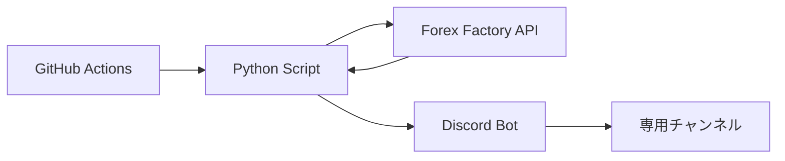

# 経済指標Discord自動通知アプリ

📊 Forex Factory Economic Calendar から重要経済指標を自動収集し、Discord Botで通知するシステム。週次カレンダー更新と毎日実績データ更新に対応

## 📋 概要

本アプリは、Forex Factoryから経済指標を取得し、Discord Botで専用チャンネルに送信します。

### 主な機能

- 🌍 **グローバル対応**: 全世界の経済指標を収集
- ⭐ **重要指標を選別**: インパクトが高い指標のみを自動フィルタリング
- 🕐 **日本時間表示**: ET→JST自動変換
- 🤖 **週次更新**: 毎週土曜22時に来週のカレンダー送信
- 🔄 **毎日更新**: 毎朝6時に実績データを更新
- 📌 **履歴保持**: 過去の実績データを保持し、履歴が見やすいように表示
- 💰 **完全無料**: APIキー不要・サーバーレス構成

## 🏗️ システム構成



### スケジュール

| 時刻 | 動作 |
|------|------|
| **土曜 22:00 JST** | 来週のカレンダー送信（予想値） |
| **毎日 6:00 JST** | 実績データで更新 |

### メッセージ管理

- **同じ週**: 古いメッセージ削除→新規送信
- **新しい週**: 前週メッセージ保持→新規送信開始

## 🚀 セットアップ手順

### 1. Discord Botの作成

詳細は [`docs/DISCORD_BOT_SETUP.md`](docs/DISCORD_BOT_SETUP.md) を参照

**必要な情報:**
- Discord Bot Token
- Discord Channel ID

### 2. ローカル環境の設定

```bash
# リポジトリをクローン
git clone https://github.com/YOUR_USERNAME/YOUR_REPO.git
cd 株価通知アプリ

# .envファイルを作成
cp .env.example .env

# .envファイルを編集
# DISCORD_BOT_TOKEN=your_bot_token_here
# DISCORD_CHANNEL_ID=your_channel_id_here
```

### 3. ローカルでテスト

```bash
# 自動セットアップ＆実行
./run_local.sh
```

成功すると、Discordの指定チャンネルにメッセージが届きます。

### 4. GitHubにデプロイ

#### 4-1. リポジトリ作成

```bash
# Gitリポジトリを初期化
git init
git add .
git commit -m "Initial commit: Discord Bot Economic Calendar"

# GitHubにプッシュ
git branch -M main
git remote add origin https://github.com/YOUR_USERNAME/YOUR_REPO.git
git push -u origin main
```

#### 4-2. GitHub Secretsの設定

1. GitHubリポジトリの **Settings** → **Secrets and variables** → **Actions**
2. **New repository secret** で以下を追加:

| Name | Value |
|------|-------|
| `DISCORD_BOT_TOKEN` | Discord Bot Token |
| `DISCORD_CHANNEL_ID` | Discord Channel ID |

#### 4-3. 手動実行でテスト

1. **Actions** タブを開く
2. **Economic Calendar Notification** を選択
3. **Run workflow** で手動実行
4. Discordで通知を確認

## 💻 ローカル実行方法

### 初回セットアップ

```bash
# .envファイルを作成
cp .env.example .env

# Bot Token と Channel ID を設定
# DISCORD_BOT_TOKEN=...
# DISCORD_CHANNEL_ID=...

# 自動セットアップ＆実行
./run_local.sh
```

このスクリプトは以下を自動で行います:
- ✅ 仮想環境の作成（初回のみ）
- ✅ 依存関係のインストール
- ✅ .envファイルの存在確認
- ✅ スクリプトの実行

## 📊 通知例

```
📢 【経済指標カレンダー】 2025-12-22 〜 2025-12-28
------------------------------------------
🕒 `12/22 22:30` 🇨🇦 **CPI m/m**
   ┗ 予: `0.1%` / 前: `0.2%`

🕒 `12/23 09:50` 🇯🇵 **GDP Growth Rate**
   ┗ 結果: `0.4%` / 予: `0.4%` / 前: `0.3%`
```

（実績が出た指標は「結果」が表示されます）

## 📁 プロジェクト構成

```
株価通知アプリ/
├── .github/
│   └── workflows/
│       └── economic_calendar.yml    # GitHub Actions（週次・毎日実行）
├── docs/
│   ├── DISCORD_BOT_SETUP.md        # Bot セットアップガイド
│   └── MIGRATION_TWELVEDATA.md     # API移行履歴
├── src/
│   └── economic_calendar.py         # メインスクリプト（Discord Bot版）
├── tests/
│   └── test_functionality.py        # テストスクリプト
├── venv/                             # 仮想環境（自動生成）
├── message_state.json                # メッセージ状態管理
├── .env.example                      # 環境変数テンプレート
├── .env                              # 環境変数（要作成、Gitから除外）
├── requirements.txt                  # Python依存関係
├── .gitignore                        # Git除外設定
├── run_local.sh                      # ローカル実行スクリプト
└── README.md                         # このファイル
```

## 🔧 トラブルシューティング

### Botが起動しない

- `DISCORD_BOT_TOKEN` が正しく設定されているか確認
- Bot が対象サーバーに招待されているか確認

### メッセージが送信されない

- `DISCORD_CHANNEL_ID` が正しいか確認
- Bot に必要な権限（View Channels, Send Messages, Manage Messages）があるか確認

### メッセージが削除されない

- Bot に「Manage Messages」権限があるか確認
- `message_state.json` の内容を確認

### Forex Factory APIエラー

- レート制限（429 Too Many Requests）の場合は時間をおいて再実行
- 週1回 + 毎日1回の実行では問題なし

## 📝 カスタマイズ

### 実行時刻を変更する

`.github/workflows/economic_calendar.yml` の cron 設定を変更:

```yaml
schedule:
  - cron: '0 13 * * 6'  # 土曜 22:00 JST
  - cron: '0 21 * * *'  # 毎日 6:00 JST
```

### 対象期間を変更する

`src/economic_calendar.py` の `get_next_week_range()` 関数を編集

### 表示する国を変更する

`src/economic_calendar.py` の `COUNTRY_FLAGS` 辞書にフラグを追加

## 📜 ライセンス

MIT License

---

**免責事項**: このツールは情報提供を目的としており、投資助言ではありません。経済指標の情報は参考としてご利用ください。
